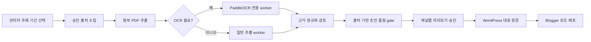

# Wisdome Super Writer

관리자 한 명이 대한민국 부동산 청약정보와 국내·글로벌 반도체 뉴스를 수집하고,
근거가 연결된 글을 만든 뒤 WordPress와 Google Blogger에 발행하는 Django/Celery 서비스입니다.
스캔 PDF와 복합 레이아웃 PDF는 로컬 PaddleOCR 3.7.0 `PP-StructureV3`로 처리합니다.

> **개발 상태:** 핵심 MVP 파이프라인과 관리자 콘솔이 구현된 개발 버전입니다. 실제 운영 전에는
> 출처별 수집기 고도화, PaddleOCR 모델 checksum 확정, 자동발행 안전 게이트 및 Phase 7 테스트를
> 완료해야 합니다. 세부 진행 상태는
> [`specs/001-automated-content-publishing/tasks.md`](specs/001-automated-content-publishing/tasks.md)를
> 기준으로 확인합니다.

## 지원 범위

| 구분 | 현재 범위 |
|---|---|
| 사용자 | Django staff 권한을 가진 관리자 전용 |
| 주제 | 대한민국 부동산 청약정보, 한국·글로벌 반도체 뉴스/속보 |
| 입력 | HTML, 구조화 데이터, PDF, 이미지, HWP/HWPX, spreadsheet, 첨부파일 |
| 문서 인식 | native PDF 우선, 스캔·복합 문서는 PaddleOCR `PP-StructureV3` |
| 결과물 | 출처 링크, 주장-근거 연결, 시각 자료와 품질 검사를 포함한 글 개정본 |
| 발행 채널 | WordPress 대표 원문 → Google Blogger 보조 배포 |
| 실행 방식 | 관리자 수동 실행 또는 `Asia/Seoul` 기준 cron 일정 |

핵심 기능은 다음과 같습니다.

- 승인된 주제별 출처 레지스트리를 기준으로 최신 자료 수집
- 원문과 첨부파일의 text, 표, 이미지, 페이지 캡처 및 locator 보존
- 주장마다 근거 snapshot과 원문 URL을 연결하고 게시 전 품질 gate 적용
- 채널별 미리보기, target별 관리자 승인, 멱등 발행 및 실패 재조정
- 일정 중복 방지, `queue_one`, 전역 kill switch, 감사 로그와 보존 정책

## 처리 흐름



## 구성

- Django 5.2: 관리자 콘솔, same-origin Admin API, session/CSRF, 재인증
- Celery 5.6 + Redis: 수집, 추출, 생성, 발행, 일정 작업
- PostgreSQL 17: 실행 상태, 근거, 승인, 발행 및 감사 데이터
- MinIO/S3: 원문, 추출 결과, 이미지와 검증 보고서
- PaddleOCR 3.7.0 + PaddlePaddle 3.x: 로컬 PDF OCR
- WordPress Core REST API와 Google Blogger API v3: 공식 발행 경로

## 빠른 로컬 실행

필요 도구는 Docker Desktop과 Docker Compose입니다. 호스트에서 Python 명령을 직접 실행하려면
Python 3.12를 사용해야 합니다. 현재 패키지는 Python 3.13 이상을 지원 대상으로 삼지 않습니다.

```powershell
Copy-Item .env.example .env
```

`.env`에서 최소한 다음 값을 운영 환경과 겹치지 않는 개발용 값으로 교체합니다.

- `DJANGO_SECRET_KEY`, `AUDIT_CURSOR_SIGNING_KEY`
- PostgreSQL과 MinIO 자격 증명
- `DJANGO_ALLOWED_HOSTS`, `DJANGO_CSRF_TRUSTED_ORIGINS`
- 아래 발행 자격 증명이 참조할 환경 변수

PaddleOCR 모델 준비를 먼저 완료한 다음 서비스를 시작합니다.

```powershell
.\deploy\compose-deploy.ps1
docker compose run --rm web python src/manage.py createsuperuser
docker compose run --rm web python src/manage.py seed_source_registry
docker compose run --rm web python src/manage.py import_extraction_profiles --root config/extraction-profiles
```

### 안전한 Compose 배포 절차

초기 실행과 이후 업그레이드는 항상 `deploy/compose-deploy.ps1`을 사용합니다.
이 스크립트는 Compose에 등록된 모든 worker 서비스가 관리 목록에 포함됐는지 먼저 검사합니다.
기존 worker와 전환용 network를 확인한 뒤 `web`과 beat를 먼저 중지해 새로운 HTTP 요청과
예약 생산을 차단하고 새 이미지를 빌드합니다. 아직 실행 중인 구버전 worker가 legacy
`collect`, `default`, `extract.generic`, `generate`, `publish` Redis 큐를 비우도록 `LLEN`을
제한 시간 동안 확인합니다. 이 drain 동안에만 기존 `worker-extract`
컨테이너를 `collection-egress`에 연결해 외부 첨부 다운로드가 실패 상태로 확정되지 않게 하고,
worker를 중지한 뒤 연결을 제거합니다.

큐가 비면 구버전 worker를 최대 40분 동안 graceful stop하고, stop 과정에서 예약·미확인
메시지가 legacy 큐로 돌아왔는지 다시 확인합니다. 메시지가 돌아오면 같은 구버전 worker
컨테이너를 한 번 다시 시작해 제한 시간 동안 재-drain한 뒤 다시 중지합니다. worker 중지 뒤
Redis broker의 `unacked` hash와 `unacked_index`도 모두 비었는지 확인하므로, 강제 종료로
visibility timeout 안에 숨은 메시지가 있으면 migration 전에 중단합니다.

legacy 큐를 완전히 비우지 못하면 migration을 시작하지 않고 `web`, beat, 구버전 worker를
중지된 상태로 남깁니다. 운영자는 큐와 worker 오류를 복구한 뒤 같은 스크립트를 다시 실행해야
합니다. 모든 drain과 migration이 성공한 뒤에도 현재 빌드의 adapter 구현과 일치하는 승인된
source snapshot v3가 있는지 검증합니다. 이 gate까지 통과한 경우에만 새 web, beat, worker를
시작합니다. Redis 비밀번호는 drain 명령 출력에 기록하지 않습니다.

`web` entrypoint는 migration을 자동 실행하지 않습니다. Compose의 web, beat, 모든 일반 worker와
OCR worker는 `migrate` 서비스의 성공 완료를 시작 조건으로 사용합니다. 따라서 임의로
`docker compose run --rm web python src/manage.py migrate`를 실행하거나 worker가 동작하는 동안
migration을 우회 실행하지 않습니다.

기본 worker 종료 대기와 legacy 큐 drain 제한 시간은 각각 2400초입니다. 작업 시간이 더 길면
두 값을 함께 늘릴 수 있습니다.

```powershell
.\deploy\compose-deploy.ps1 `
  -StopTimeoutSeconds 3600 `
  -LegacyDrainTimeoutSeconds 3600
```

### Safe Compose deployment contract (English)

Use `deploy/compose-deploy.ps1` for both first boot and every upgrade. The script verifies
that its inventory covers every configured worker. It checks the existing workers and
transition network, stops web and beat so no new HTTP or scheduled work is produced, and
then builds the new images. Existing old worker containers remain available while the
script polls Redis `LLEN` for the legacy `collect`,
`default`, `extract.generic`, `generate`, and `publish` queues. For this drain only, the
existing old `worker-extract` containers are attached to `collection-egress`, preventing
legacy fan-out deliveries from finalizing attachment download failures. The temporary
network attachment is removed after the workers stop.

The script then gracefully stops those workers and checks the queues again. Messages
restored during shutdown cause the same old containers to be restarted for one bounded
re-drain and stopped again. After every worker stop, the script also requires the Redis
broker's `unacked` hash and `unacked_index` to be empty, so a delivery hidden by a forced
stop and its visibility timeout blocks migration.

Migration does not start unless all five legacy queues remain empty after the final stop.
A drain timeout aborts with web, beat, and old workers stopped. Migration failure also
leaves all application processes stopped. After migration, deployment verifies that an
approved source snapshot v3 matches the adapter implementation in the new build. Web,
beat, and workers start only after that gate passes. Redis credentials are not printed by
the drain commands. The web entrypoint does not run migrations. Do not bypass this path
with an ad-hoc migration while workers are running.

접속 주소:

- 관리자 콘솔: `http://localhost:8000/console/`
- Django Admin: `http://localhost:8000/admin/`
- liveness: `http://localhost:8000/health/live`
- readiness: `http://localhost:8000/health/ready`

소스 레지스트리와 추출 프로필 import는 불변 draft만 생성합니다. 관리자 검토·재인증·승인 전에는
자동 수집이나 자동 발행에 사용할 수 없습니다.

## 관리자 사용 순서

1. `/admin/`에서 관리자 계정을 확인하고 `/console/`에 로그인합니다.
2. 출처 레지스트리와 추출 프로필의 material, checksum, 검증 보고서를 검토한 뒤 승인합니다.
3. **실행** 화면에서 주제와 수집 시간창을 지정해 collection run을 만듭니다.
4. run 상세에서 원문, 첨부파일, OCR locator와 저신뢰 근거를 검토합니다.
5. 생성된 article의 주장·출처·품질 검사를 확인하고 필요한 경우 새 revision을 만듭니다.
6. **발행** 화면에서 WordPress/Blogger target을 선택하고 채널별 최종 render를 승인합니다.
7. WordPress 공개 URL 확인 후 Blogger 후속 발행 상태를 확인합니다.
8. 반복 작업은 **운영** 화면에서 cron 일정과 중복 정책을 설정합니다.

API는 `/api/v1/` 아래에 있으며 관리자 session과 CSRF 보호를 사용합니다. 전체 계약은
[`admin-api.openapi.yaml`](specs/001-automated-content-publishing/contracts/admin-api.openapi.yaml)에
정의되어 있습니다.

## PaddleOCR 모델 준비

OCR worker는 `paddleocr[doc-parser]==3.7.0`, PaddlePaddle 3.x와 명시적인 로컬 모델 경로만
사용합니다. 실행 중 모델 다운로드와 다른 OCR 엔진으로의 자동 전환은 허용하지 않습니다.

1. 빌드/준비 환경에서 PaddleOCR 공식 배포본으로 모델 파일을 내려받습니다.
2. `config/extraction-profiles/paddleocr/`의 model manifest에 기록된 디렉터리와 파일 SHA-256을
   실제 파일에 맞게 확정합니다. 최소 인식 모델은 다음 두 개입니다.
   - `korean_PP-OCRv5_mobile_rec`
   - `en_PP-OCRv5_mobile_rec`
3. 방향·왜곡·수식·표 기능을 프로필에서 활성화했다면 manifest에 지정된
   `PP-LCNet_x1_0_doc_ori`, `UVDoc`, `PP-LCNet_x1_0_textline_ori`,
   `PP-FormulaNet_plus-M`, `SLANeXt_wired` 파일도 함께 준비합니다.
4. 준비한 디렉터리를 로컬의 `models/paddleocr/`에 놓고 Compose의 read-only 모델 볼륨에 한 번만
   복사합니다.

```powershell
docker compose create ocr-worker
$PaddleVolume = docker volume ls `
  --filter label=com.docker.compose.project=wisdome-super-writer `
  --filter label=com.docker.compose.volume=paddle-models `
  --format "{{.Name}}"
docker run --rm `
  -v "${PaddleVolume}:/models" `
  -v "${PWD}/models/paddleocr:/seed:ro" `
  alpine sh -c "cp -a /seed/. /models/"
```

프로필을 import한 뒤 worker를 열기 전에 버전·manifest·모든 파일 checksum을 검증합니다.

```powershell
docker compose run --rm ocr-worker python src/manage.py verify_ocr_manifest
docker compose run --rm ocr-worker python src/manage.py verify_extraction_profile_snapshots --require-approved-mvp
```

검증 실패 시 OCR worker를 운영 큐에 연결하지 마십시오. 모델 bytes 또는 설정이 바뀌면 기존
프로필을 수정하지 말고 새 profile version과 material hash를 만들어 다시 승인해야 합니다.

## WordPress 연결

WordPress는 HTTPS 사이트와 Core REST API `/wp-json/wp/v2`를 사용합니다.

1. 전용 WordPress 사용자에게 필요한 최소 글·미디어 권한만 부여합니다.
2. WordPress 사용자 화면에서 Application Password를 새로 발급합니다.
3. 실제 값은 DB나 요청 본문에 넣지 말고 `.env` 또는 운영 비밀 저장소에 보관합니다.

```dotenv
WORDPRESS_USERNAME=wisdome-publisher
WORDPRESS_APPLICATION_PASSWORD=replace-me
```

발행 대상 생성 시 `usernameRef`는 `env://WORDPRESS_USERNAME`, `credentialRef`는
`env://WORDPRESS_APPLICATION_PASSWORD`로 지정합니다. 사전 점검과 격리 test target canary가
통과한 뒤에만 운영 target 자동 발행을 활성화합니다. Application Password는 정기적으로 교체하고,
폐기할 때 대상 연결도 함께 해제합니다.

## Google Blogger 연결

1. Google Cloud 프로젝트에서 Blogger API v3를 활성화합니다.
2. OAuth 동의 화면과 Web application client를 구성합니다.
3. redirect URI를 배포 주소의
   `/api/v1/publishing/oauth/google/callback`으로 정확히 등록합니다.
4. 최소 Blogger 쓰기 범위로 동의를 받고 access/refresh token은 비밀 저장소에만 보관합니다.

OAuth 연결 화면을 사용하려면 client secret은 참조로만 설정하고, callback에서 받은 token을
Vault/KMS에 저장한 뒤 `credentialRef`를 반환하는 writer callable을 지정합니다.

```dotenv
BLOGGER_OAUTH_CLIENT_ID_REF=env://BLOGGER_OAUTH_CLIENT_ID
BLOGGER_OAUTH_CLIENT_SECRET_REF=env://BLOGGER_OAUTH_CLIENT_SECRET
BLOGGER_OAUTH_CLIENT_ID=replace-me.apps.googleusercontent.com
BLOGGER_OAUTH_CLIENT_SECRET=replace-me
BLOGGER_OAUTH_TOKEN_STORE=my_secrets.blogger.store_token
SECRET_PROVIDER_CLASSES={"vault":"my_secrets.vault.VaultSecretProvider"}
```

`BLOGGER_OAUTH_TOKEN_STORE` callable은 `target_id`, `token_payload` keyword 인자를 받고 실제
token을 외부 비밀 저장소에 기록한 뒤 `vault://...` 같은 참조 문자열만 반환해야 합니다.
callable이 `operation_key` 또는 임의 keyword 인자를 선언하면 callback은 서명된 OAuth nonce를
`operation_key`로 함께 전달합니다. 비밀 저장소 writer는 이 값을 멱등 key로 사용해 동일 callback의
재실행이 새 secret을 만들지 않도록 구현하는 것을 권장합니다. 기존 두 인자 callable도 호환되지만,
비밀 저장 성공 직후 프로세스가 중단되는 경우의 고아 secret 자동 조정은 T023 후속 범위입니다.
`SECRET_PROVIDER_CLASSES`는 그 참조 scheme을 읽는 provider를 연결합니다.
이미 발급한 access token으로 로컬 점검만 할 때는 `BLOGGER_ACCESS_TOKEN`을 환경에 넣고 대상의
`credentialRef=env://BLOGGER_ACCESS_TOKEN`을 지정할 수 있습니다.
대상 생성 시 대상 `remoteBlogId`도 지정합니다.
토큰 만료·폐기 시 발행은 실패 닫힘으로 중단되며, 새 토큰을 비밀 저장소에 반영한 뒤 preflight를
다시 통과해야 합니다. WordPress가 primary 원문이고 Blogger는 secondary 배포 채널입니다.

### Blogger OAuth secret-store contract (English)

`BLOGGER_OAUTH_TOKEN_STORE` receives `target_id` and `token_payload` keyword arguments,
writes the token to an external secret store, and returns only a reference such as
`vault://...`. If the callable declares `operation_key` or arbitrary keyword arguments,
the callback also passes the signed OAuth nonce as `operation_key`. Secret-store writers
should use it as an idempotency key so replaying the same callback does not create another
secret. Existing two-argument writers remain compatible. Automatic reconciliation of an
orphan secret after a process crash immediately following the secret-store write remains
in T023 scope. `SECRET_PROVIDER_CLASSES` resolves the returned reference scheme.

## Celery 큐

| 큐 | 담당 작업 |
|---|---|
| `outbox.dispatch` | due outbox lease·전달 |
| `source.check` | 승인 전 출처 외부 접근·파싱 점검 |
| `collect.housing` | 부동산 청약 출처 수집 |
| `collect.semiconductor` | 반도체 출처 수집 |
| `source.change` | 정정·철회·접근 불가 영향 평가 |
| `extract.fanout` | 외부 첨부 다운로드, 객체 저장 및 추출 fan-out |
| `extract.document` | 문서 완료 집계와 evidence finalizer |
| `extract.generic` | 저장된 객체의 native PDF, HTML, HWP/HWPX, spreadsheet 추출 |
| `extract.ocr.paddle` | PaddleOCR 전용 PDF 인식 |
| `editorial` | 근거 기반 글 생성 |
| `publish.media.wordpress` | WordPress media와 공개 객체 작업 |
| `publish.wordpress` | WordPress preflight, canary와 발행 |
| `publish.blogger` | Blogger preflight, canary와 발행 |
| `reconcile` | 채널별 원격 결과 조정 |
| `maintenance` | 감사·보존·일정 등 일반 제어 작업 |

`worker-source-check`는 `outbox.dispatch`와 `source.check`만 소비하며
`collection-egress`를 통해 승인 전 출처 점검을 격리 실행합니다. `extract.fanout`은
서비스 키가 없는 `worker-evidence-fanout`이 `collection-egress`와 object storage에 접근해
처리합니다. `worker-collect`는 수집 큐만 소비하고, `source.change`는 편집 worker가 처리합니다.
`worker-extract`는 외부 egress 없이 저장된 객체만 읽습니다. Beat는 한 인스턴스만 실행하고
5초마다 전용 큐의 outbox dispatcher를 호출하며, dispatcher가 due schedule scan과 versioned
event 전달을 수행합니다.

### Celery queue contract (English)

`worker-source-check` consumes only `outbox.dispatch` and `source.check`, with collection
egress for isolated pre-approval probes. `extract.fanout` is consumed by
`worker-evidence-fanout`, which has collection egress and object storage access but no
public-data service key. `worker-collect` consumes collection queues only, and
`source.change` is handled by the editorial worker. `worker-extract` remains without external
egress and only reads stored objects from `extract.document` and `extract.generic`.
Beat invokes the outbox dispatcher on its dedicated queue every five seconds; the
dispatcher runs the due-schedule scan and routes versioned events to the topic- or
channel-specific queues listed above.

## 주택 공고 수집

청약홈은 [한국부동산원 청약홈 분양정보 API](https://www.data.go.kr/data/15098547/openapi.do),
LH는 공공데이터포털의
[공고 목록](https://www.data.go.kr/data/15058530/openapi.do)·
[공고 상세](https://www.data.go.kr/data/15057999/openapi.do)·
[공급 정보](https://www.data.go.kr/data/15056765/openapi.do) API를 사용한다.
`DATA_GO_KR_SERVICE_KEY`는 `worker-source-check`와 `worker-collect`에만 전달되며,
레지스트리에는 `env://DATA_GO_KR_SERVICE_KEY` 참조만 저장된다. 인증 요청은 HTTPS의
고정된 공식 host/path에서만 가능하고 다른 환경 변수·DB credential reference는 거부된다.

수집기는 기간 조건과 page 상한을 적용하고 목록 page 반복, 중복 공식 ID, 필수 구조 누락을
실패로 처리한다. 전체 건수가 남았는데 빈 page가 오거나 request/elapsed budget을 소진해도
부분 성공으로 저장하지 않는다. 청약홈은 `applyhome:{category}:{houseManageNo}:{pblancNo}`, LH는
`lh:{CCR_CNNT_SYS_DS_CD}:{PAN_ID}:{UPP_AIS_TP_CD}:{AIS_TP_CD}`를 lineage key로 쓴다.
요청 시간창 밖에서는 이미 관측한 ID만 승인된 reconciliation 기간 안에서 다시 조회해 오래된
공고의 정정·철회·복원을 찾는다. 공식 상세 페이지의 HTML 링크와 API 상세·공급 응답에서
첨부 원문을 찾고, frozen `recordHosts`만 evidence 다운로드에 사용한다.
정정·철회·접근 불가 상태는 공식 응답이 명시할 때만 저장하며, 네트워크 장애를 자료 철회로
추정하지 않는다. 동일 버전은 SourceItem을 재사용하고 각 실행의 RunSourceItem은 직전 관측을
가리켜 `unchanged`, `corrected`, `retracted`, `unavailable`, `restored` 전이를 보존한다.
새 snapshot은 adapter version과 실제 구현 파일 checksum manifest를 함께 고정한다.
`unchanged`와 terminal 상태는 신규 evidence를 만들지 않고, terminal 상태는 기존 글의 영향
평가로 분기한다.

레거시 hash와 내용이 정확히 맞는 첫 관측은 현재 hash schema의 기준 SourceItem을 새로
기록하되 `unchanged`로 분류한다. 이후 raw bytes, HTTP validator 또는 첨부 checksum만
달라져도 새 버전으로 감지한다. SourceItem과 RunSourceItem은 모두 append-only이며,
RunSourceItem은 실행 registry에 활성화된 snapshot과 성공한 직전 관측만 가리킬 수 있다.
동시 worker의 응답은 성공 attempt의 checksum과 다시 대조하고 이미 다음 단계로 간 run을
되돌리지 않는다.

응답 payload의 credential 계열 필드는 저장 전에 마스킹한다. request budget은 adapter 함수
호출 수가 아니라 redirect와 다중 IP 재시도를 포함한 실제 HTTP 시도 수를 센다. 첨부는 frozen
`attachmentContentTypes`와 선언·sniff MIME이 일치해야 저장되며, 공식 file ID를 보존한다.
실행형 HTML handler에서 공개 URL을 안전하게 해석할 수 없으면 첨부를 누락하지 않고 source
실패로 닫는다. 연속 terminal 전이와 복원은 전체 관측 lineage에서 영향받은 글을 찾아
철회·접근 불가·복원 correction case로 연결한다.

### Housing collection contract (English)

ApplyHome and LH collection uses their official public-data APIs with bounded pagination,
stable provider identifiers, deterministic per-notice checksums, detail/supply enrichment,
and official-page attachment discovery. Credentials are resolved only inside the isolated
source-check and collection workers, and authenticated requests are bound to exact HTTPS
host/path and credential profiles. Frozen record hosts, implementation-file checksums,
request/elapsed budgets, total-count coverage, and observed-lineage reconciliation all
fail closed. Unchanged and terminal observations do not start fresh extraction; terminal
changes are routed to published-article impact evaluation. Transport failures remain
attempt failures; only an explicit provider signal can create corrected, retracted, or
unavailable source state. Legacy cutover writes a current-schema baseline while
classifying the first compatible observation as unchanged, so later raw, validator, and
attachment-only changes remain visible. SourceItem and RunSourceItem are append-only and
registry-bound. Physical HTTP attempts consume the frozen request budget, credential-like
payload fields are redacted, and attachment downloads enforce the frozen declared/sniffed
MIME contract. Consecutive terminal and restored observations resolve article impact
through the full immutable lineage.

## 프로젝트 구조

```text
.
├── config/                         # 출처, 편집 정책, 추출 profile, 보존 정책
├── deploy/containers/              # web 및 PaddleOCR worker 이미지
├── specs/001-automated-content-publishing/
│   ├── spec.md                     # 기능 요구사항
│   ├── plan.md                     # 기술 설계
│   ├── tasks.md                    # 구현 진행 상태
│   └── contracts/                  # Admin API와 adapter 계약
├── src/
│   ├── adapters/                   # source, extractor, publisher, storage adapter
│   ├── apps/                       # Django domain apps
│   └── wisdome_writer/             # settings, API, Celery, 공통 infrastructure
├── compose.yaml
└── pyproject.toml
```

주요 Django 앱:

| 앱 | 역할 |
|---|---|
| `topics` | 주제 정책, 출처 정의와 불변 registry snapshot |
| `collection` | collection run, source version, 실행 단계 |
| `evidence` | 문서 추출, PaddleOCR routing, locator와 검토 결정 |
| `editorial` | article revision, 주장-근거 연결, 품질 검사와 정정 |
| `publishing` | target, 승인, WordPress/Blogger 발행과 reconcile |
| `scheduling` | cron 일정, 중복 정책, kill switch |
| `audit` | append-only 감사 이벤트와 hold-aware 보존 |

## 개발 확인 명령

호스트에서 실행할 때는 Python 3.12 가상환경을 사용합니다.

```powershell
python -m venv .venv
.\.venv\Scripts\Activate.ps1
python -m pip install -e ".[dev]"
python src/manage.py check
python src/manage.py makemigrations --check --dry-run
```

테스트 구현은 현재 Spec Kit Phase 7 후속 작업입니다. 테스트 파일이 준비된 뒤에는 다음 명령을
기준으로 실행합니다.

```powershell
pytest
```

## 비밀·운영 원칙

- `.env`, OAuth token, cookie, Application Password를 커밋하거나 AuditEvent에 기록하지 않습니다.
- 모든 `/api/v1/*` 요청은 관리자 session과 `X-CSRFToken`을 함께 요구합니다. OAuth callback만
  CSRF header 규칙에서 제외되고 로그인 session은 계속 필요합니다.
- 자동발행 활성화, kill switch 해제, 철회, credential 해제와 보존 삭제는 5분 이내 단회
  재인증 proof가 필요합니다.
- 외부 쓰기 결과가 불명확하면 같은 글을 새로 만들지 말고 remote marker로 reconcile합니다.
- 원문과 증거에는 출처·권리·checksum을 보존하고, 게시 글의 사실 주장은 근거 snapshot과 연결합니다.

### 감사 데이터베이스 역할 경계

Compose의 `migrate` 서비스만 `POSTGRES_USER`/`POSTGRES_PASSWORD` owner 연결을 사용합니다.
web, worker, OCR worker, beat는 별도의
`POSTGRES_RUNTIME_USER`/`POSTGRES_RUNTIME_PASSWORD` 연결을 사용합니다. migration이 끝나면
`configure_runtime_database_role` 명령이 runtime 역할을 생성하거나 제한된 상태로 다시
구성합니다. runtime 역할에는 일반 업무 테이블의 `SELECT`/`INSERT`/`UPDATE`/`DELETE`,
sequence의 `USAGE`/`SELECT`, `audit_auditevent`의 `SELECT`/`INSERT`만 부여합니다. DB/schema
생성, table 소유권, 역할 상속·생성, replication, RLS 우회, 감사 테이블
`UPDATE`/`DELETE`/`TRUNCATE` 및 trigger 관리 권한은 부여하지 않습니다. runtime 역할이 owner와
같거나 이미 객체를 소유하면 구성 명령은 자동 권한 이전 없이 실패합니다.

`AuditEvent` migration은 PostgreSQL에서 일반 SQL `UPDATE`/`DELETE`/`TRUNCATE`를 거부하는
statement trigger도 설치합니다. SQLite 개발 DB는 raw `UPDATE`/`DELETE` 거부 trigger를
사용하며 SQLite에는 `TRUNCATE` 문법이 없습니다. owner 자격증명은 migration 서비스 밖에
제공하지 않아야 하며, 감사 만료를 위한 범용 trigger 우회 설정은 두지 않습니다.

### 감사 데이터베이스 별칭 지원

감사 대상 mutation은 현재 명시적인 `default` 데이터베이스 별칭만 지원합니다. `AuditContext`는
다른 별칭을 업무 row 변경 전에 거부하고, 업무 entity와 감사 insert가 같은 별칭 및 같은 outer
transaction에 속하는지 다시 확인합니다. 다중 데이터베이스 감사 mutation은 별도 설계 없이는
지원되지 않습니다.

### Audit database role boundary (English)

Only the Compose `migrate` service uses the owner connection from
`POSTGRES_USER`/`POSTGRES_PASSWORD`. Web, workers, the OCR worker, and beat use the
separate `POSTGRES_RUNTIME_USER`/`POSTGRES_RUNTIME_PASSWORD` connection. After migrations,
`configure_runtime_database_role` creates or reconfigures the runtime role to a restricted
state. It grants ordinary business-table `SELECT`/`INSERT`/`UPDATE`/`DELETE`, sequence
`USAGE`/`SELECT`, and only `SELECT`/`INSERT` on `audit_auditevent`. The runtime role receives
no database/schema creation, object ownership, role inheritance or creation, replication,
RLS bypass, audit-table `UPDATE`/`DELETE`/`TRUNCATE`, or trigger-management authority. The
command fails without transferring ownership if the runtime role equals the owner or
already owns objects.

The `AuditEvent` migration also installs a PostgreSQL statement trigger rejecting ordinary
SQL `UPDATE`/`DELETE`/`TRUNCATE`. The SQLite development database rejects raw
`UPDATE`/`DELETE` with triggers; SQLite has no `TRUNCATE` syntax. Owner credentials must
remain unavailable outside the migration service. No general audit-retention trigger
bypass is provided.

### Audit database-alias support (English)

Audited mutations currently support only the explicit `default` database alias.
`AuditContext` rejects any other alias before changing business rows and rechecks that the
business entity and audit insert share both the alias and the outer transaction.
Multi-database audited mutations are unsupported without a separate design.

## 종료

```powershell
docker compose down
```

데이터까지 제거하는 `docker compose down -v`는 PostgreSQL, MinIO, Redis와 Paddle 모델 볼륨을
삭제하므로 명시적인 폐기 상황이 아니면 실행하지 마십시오.
