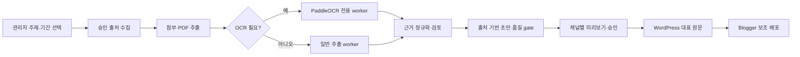

# Wisdome Super Writer

관리자 한 명이 대한민국 부동산 청약정보와 국내·글로벌 반도체 뉴스를 수집하고,
근거가 연결된 글을 만든 뒤 WordPress와 Google Blogger에 발행하는 Django/Celery 서비스입니다.
스캔 PDF와 복합 레이아웃 PDF는 로컬 PaddleOCR 3.7.0 `PP-StructureV3`로 처리합니다.

> **개발 상태:** 핵심 MVP 파이프라인과 관리자 콘솔이 구현된 개발 버전입니다. 실제 운영 전에는
> 출처별 수집기 고도화, PaddleOCR 모델 checksum 확정, 자동발행 안전 게이트 및 Phase 7 테스트를
> 완료해야 합니다. 세부 진행 상태는
> [`specs/001-automated-content-publishing/tasks.md`](specs/001-automated-content-publishing/tasks.md)를
> 기준으로 확인합니다.

## 지원 범위

| 구분 | 현재 범위 |
|---|---|
| 사용자 | Django staff 권한을 가진 관리자 전용 |
| 주제 | 대한민국 부동산 청약정보, 한국·글로벌 반도체 뉴스/속보 |
| 입력 | HTML, 구조화 데이터, PDF, 이미지, HWP/HWPX, spreadsheet, 첨부파일 |
| 문서 인식 | native PDF 우선, 스캔·복합 문서는 PaddleOCR `PP-StructureV3` |
| 결과물 | 출처 링크, 주장-근거 연결, 시각 자료와 품질 검사를 포함한 글 개정본 |
| 발행 채널 | WordPress 대표 원문 → Google Blogger 보조 배포 |
| 실행 방식 | 관리자 수동 실행 또는 `Asia/Seoul` 기준 cron 일정 |

핵심 기능은 다음과 같습니다.

- 승인된 주제별 출처 레지스트리를 기준으로 최신 자료 수집
- 원문과 첨부파일의 text, 표, 이미지, 페이지 캡처 및 locator 보존
- 주장마다 근거 snapshot과 원문 URL을 연결하고 게시 전 품질 gate 적용
- 채널별 미리보기, target별 관리자 승인, 멱등 발행 및 실패 재조정
- 일정 중복 방지, `queue_one`, 전역 kill switch, 감사 로그와 보존 정책

## 처리 흐름



## 구성

- Django 5.2: 관리자 콘솔, same-origin Admin API, session/CSRF, 재인증
- Celery 5.6 + Redis: 수집, 추출, 생성, 발행, 일정 작업
- PostgreSQL 17: 실행 상태, 근거, 승인, 발행 및 감사 데이터
- MinIO/S3: 원문, 추출 결과, 이미지와 검증 보고서
- PaddleOCR 3.7.0 + PaddlePaddle 3.x: 로컬 PDF OCR
- WordPress Core REST API와 Google Blogger API v3: 공식 발행 경로

## 빠른 로컬 실행

필요 도구는 Docker Desktop과 Docker Compose입니다. 호스트에서 Python 명령을 직접 실행하려면
Python 3.12를 사용해야 합니다. 현재 패키지는 Python 3.13 이상을 지원 대상으로 삼지 않습니다.

```powershell
Copy-Item .env.example .env
```

`.env`에서 최소한 다음 값을 운영 환경과 겹치지 않는 개발용 값으로 교체합니다.

- `DJANGO_SECRET_KEY`, `AUDIT_CURSOR_SIGNING_KEY`
- PostgreSQL과 MinIO 자격 증명
- `DJANGO_ALLOWED_HOSTS`, `DJANGO_CSRF_TRUSTED_ORIGINS`
- 아래 발행 자격 증명이 참조할 환경 변수

PaddleOCR 모델 준비를 먼저 완료한 다음 서비스를 시작합니다.

```powershell
.\deploy\compose-deploy.ps1
docker compose run --rm web python src/manage.py createsuperuser
docker compose run --rm web python src/manage.py seed_source_registry
docker compose run --rm web python src/manage.py import_extraction_profiles --root config/extraction-profiles
```

### 안전한 Compose 배포 절차

초기 실행과 이후 업그레이드는 항상 `deploy/compose-deploy.ps1`을 사용합니다.
이 스크립트는 Compose에 등록된 beat와 모든 worker 서비스가 관리 목록에 포함됐는지 먼저
검사하고, 이미 실행 중인 beat와 worker를 모두 중지한 뒤 one-shot `migrate` 서비스를
실행합니다. migration이 성공한 경우에만 web, beat, worker를 다시 시작합니다. migration이
실패하면 소비자는 중지된 상태로 남으므로 원인을 해결한 뒤 같은 스크립트를 다시 실행합니다.

`web` entrypoint는 migration을 자동 실행하지 않습니다. Compose의 web, beat, 모든 일반 worker와
OCR worker는 `migrate` 서비스의 성공 완료를 시작 조건으로 사용합니다. 따라서 임의로
`docker compose run --rm web python src/manage.py migrate`를 실행하거나 worker가 동작하는 동안
migration을 우회 실행하지 않습니다.

기본 worker 종료 대기 시간은 120초입니다. 장시간 작업을 마칠 시간이 더 필요하면 다음처럼
늘릴 수 있습니다.

```powershell
.\deploy\compose-deploy.ps1 -StopTimeoutSeconds 300
```

### Safe Compose deployment contract (English)

Use `deploy/compose-deploy.ps1` for both first boot and every upgrade. The script verifies
that its quiesce inventory covers beat and every configured worker, stops those consumers,
runs the one-shot `migrate` service, and restarts web and the consumers only after migration
succeeds. A failed migration leaves the consumers stopped. The web entrypoint does not run
migrations, and all Compose application consumers depend on successful migration completion.
Do not bypass this path with an ad-hoc migration while workers are running.

접속 주소:

- 관리자 콘솔: `http://localhost:8000/console/`
- Django Admin: `http://localhost:8000/admin/`
- liveness: `http://localhost:8000/health/live`
- readiness: `http://localhost:8000/health/ready`

소스 레지스트리와 추출 프로필 import는 불변 draft만 생성합니다. 관리자 검토·재인증·승인 전에는
자동 수집이나 자동 발행에 사용할 수 없습니다.

## 관리자 사용 순서

1. `/admin/`에서 관리자 계정을 확인하고 `/console/`에 로그인합니다.
2. 출처 레지스트리와 추출 프로필의 material, checksum, 검증 보고서를 검토한 뒤 승인합니다.
3. **실행** 화면에서 주제와 수집 시간창을 지정해 collection run을 만듭니다.
4. run 상세에서 원문, 첨부파일, OCR locator와 저신뢰 근거를 검토합니다.
5. 생성된 article의 주장·출처·품질 검사를 확인하고 필요한 경우 새 revision을 만듭니다.
6. **발행** 화면에서 WordPress/Blogger target을 선택하고 채널별 최종 render를 승인합니다.
7. WordPress 공개 URL 확인 후 Blogger 후속 발행 상태를 확인합니다.
8. 반복 작업은 **운영** 화면에서 cron 일정과 중복 정책을 설정합니다.

API는 `/api/v1/` 아래에 있으며 관리자 session과 CSRF 보호를 사용합니다. 전체 계약은
[`admin-api.openapi.yaml`](specs/001-automated-content-publishing/contracts/admin-api.openapi.yaml)에
정의되어 있습니다.

## PaddleOCR 모델 준비

OCR worker는 `paddleocr[doc-parser]==3.7.0`, PaddlePaddle 3.x와 명시적인 로컬 모델 경로만
사용합니다. 실행 중 모델 다운로드와 다른 OCR 엔진으로의 자동 전환은 허용하지 않습니다.

1. 빌드/준비 환경에서 PaddleOCR 공식 배포본으로 모델 파일을 내려받습니다.
2. `config/extraction-profiles/paddleocr/`의 model manifest에 기록된 디렉터리와 파일 SHA-256을
   실제 파일에 맞게 확정합니다. 최소 인식 모델은 다음 두 개입니다.
   - `korean_PP-OCRv5_mobile_rec`
   - `en_PP-OCRv5_mobile_rec`
3. 방향·왜곡·수식·표 기능을 프로필에서 활성화했다면 manifest에 지정된
   `PP-LCNet_x1_0_doc_ori`, `UVDoc`, `PP-LCNet_x1_0_textline_ori`,
   `PP-FormulaNet_plus-M`, `SLANeXt_wired` 파일도 함께 준비합니다.
4. 준비한 디렉터리를 로컬의 `models/paddleocr/`에 놓고 Compose의 read-only 모델 볼륨에 한 번만
   복사합니다.

```powershell
docker compose create ocr-worker
$PaddleVolume = docker volume ls `
  --filter label=com.docker.compose.project=wisdome-super-writer `
  --filter label=com.docker.compose.volume=paddle-models `
  --format "{{.Name}}"
docker run --rm `
  -v "${PaddleVolume}:/models" `
  -v "${PWD}/models/paddleocr:/seed:ro" `
  alpine sh -c "cp -a /seed/. /models/"
```

프로필을 import한 뒤 worker를 열기 전에 버전·manifest·모든 파일 checksum을 검증합니다.

```powershell
docker compose run --rm ocr-worker python src/manage.py verify_ocr_manifest
docker compose run --rm ocr-worker python src/manage.py verify_extraction_profile_snapshots --require-approved-mvp
```

검증 실패 시 OCR worker를 운영 큐에 연결하지 마십시오. 모델 bytes 또는 설정이 바뀌면 기존
프로필을 수정하지 말고 새 profile version과 material hash를 만들어 다시 승인해야 합니다.

## WordPress 연결

WordPress는 HTTPS 사이트와 Core REST API `/wp-json/wp/v2`를 사용합니다.

1. 전용 WordPress 사용자에게 필요한 최소 글·미디어 권한만 부여합니다.
2. WordPress 사용자 화면에서 Application Password를 새로 발급합니다.
3. 실제 값은 DB나 요청 본문에 넣지 말고 `.env` 또는 운영 비밀 저장소에 보관합니다.

```dotenv
WORDPRESS_USERNAME=wisdome-publisher
WORDPRESS_APPLICATION_PASSWORD=replace-me
```

발행 대상 생성 시 `usernameRef`는 `env://WORDPRESS_USERNAME`, `credentialRef`는
`env://WORDPRESS_APPLICATION_PASSWORD`로 지정합니다. 사전 점검과 격리 test target canary가
통과한 뒤에만 운영 target 자동 발행을 활성화합니다. Application Password는 정기적으로 교체하고,
폐기할 때 대상 연결도 함께 해제합니다.

## Google Blogger 연결

1. Google Cloud 프로젝트에서 Blogger API v3를 활성화합니다.
2. OAuth 동의 화면과 Web application client를 구성합니다.
3. redirect URI를 배포 주소의
   `/api/v1/publishing/oauth/google/callback`으로 정확히 등록합니다.
4. 최소 Blogger 쓰기 범위로 동의를 받고 access/refresh token은 비밀 저장소에만 보관합니다.

OAuth 연결 화면을 사용하려면 client secret은 참조로만 설정하고, callback에서 받은 token을
Vault/KMS에 저장한 뒤 `credentialRef`를 반환하는 writer callable을 지정합니다.

```dotenv
BLOGGER_OAUTH_CLIENT_ID_REF=env://BLOGGER_OAUTH_CLIENT_ID
BLOGGER_OAUTH_CLIENT_SECRET_REF=env://BLOGGER_OAUTH_CLIENT_SECRET
BLOGGER_OAUTH_CLIENT_ID=replace-me.apps.googleusercontent.com
BLOGGER_OAUTH_CLIENT_SECRET=replace-me
BLOGGER_OAUTH_TOKEN_STORE=my_secrets.blogger.store_token
SECRET_PROVIDER_CLASSES={"vault":"my_secrets.vault.VaultSecretProvider"}
```

`BLOGGER_OAUTH_TOKEN_STORE` callable은 `target_id`, `token_payload` keyword 인자를 받고 실제
token을 외부 비밀 저장소에 기록한 뒤 `vault://...` 같은 참조 문자열만 반환해야 합니다.
`SECRET_PROVIDER_CLASSES`는 그 참조 scheme을 읽는 provider를 연결합니다.
이미 발급한 access token으로 로컬 점검만 할 때는 `BLOGGER_ACCESS_TOKEN`을 환경에 넣고 대상의
`credentialRef=env://BLOGGER_ACCESS_TOKEN`을 지정할 수 있습니다.
대상 생성 시 대상 `remoteBlogId`도 지정합니다.
토큰 만료·폐기 시 발행은 실패 닫힘으로 중단되며, 새 토큰을 비밀 저장소에 반영한 뒤 preflight를
다시 통과해야 합니다. WordPress가 primary 원문이고 Blogger는 secondary 배포 채널입니다.

## Celery 큐

| 큐 | 담당 작업 |
|---|---|
| `default` | 일정 dispatch, 보존 등 제어 작업 |
| `collect` | 출처 수집 |
| `extract.generic` | native PDF, HTML, HWP/HWPX, spreadsheet 및 근거 orchestration |
| `extract.ocr.paddle` | PaddleOCR 전용 PDF 인식 |
| `generate` | 근거 기반 글 생성 |
| `publish` | WordPress/Blogger 발행과 reconcile |

Beat는 한 인스턴스만 실행하고 60초마다
`apps.scheduling.tasks.dispatch_due_schedules_task`를 호출합니다. 일정 중복 방지는 PostgreSQL
잠금과 dispatch 멱등키가 담당합니다.

## 프로젝트 구조

```text
.
├── config/                         # 출처, 편집 정책, 추출 profile, 보존 정책
├── deploy/containers/              # web 및 PaddleOCR worker 이미지
├── specs/001-automated-content-publishing/
│   ├── spec.md                     # 기능 요구사항
│   ├── plan.md                     # 기술 설계
│   ├── tasks.md                    # 구현 진행 상태
│   └── contracts/                  # Admin API와 adapter 계약
├── src/
│   ├── adapters/                   # source, extractor, publisher, storage adapter
│   ├── apps/                       # Django domain apps
│   └── wisdome_writer/             # settings, API, Celery, 공통 infrastructure
├── compose.yaml
└── pyproject.toml
```

주요 Django 앱:

| 앱 | 역할 |
|---|---|
| `topics` | 주제 정책, 출처 정의와 불변 registry snapshot |
| `collection` | collection run, source version, 실행 단계 |
| `evidence` | 문서 추출, PaddleOCR routing, locator와 검토 결정 |
| `editorial` | article revision, 주장-근거 연결, 품질 검사와 정정 |
| `publishing` | target, 승인, WordPress/Blogger 발행과 reconcile |
| `scheduling` | cron 일정, 중복 정책, kill switch |
| `audit` | append-only 감사 이벤트와 hold-aware 보존 |

## 개발 확인 명령

호스트에서 실행할 때는 Python 3.12 가상환경을 사용합니다.

```powershell
python -m venv .venv
.\.venv\Scripts\Activate.ps1
python -m pip install -e ".[dev]"
python src/manage.py check
python src/manage.py makemigrations --check --dry-run
```

테스트 구현은 현재 Spec Kit Phase 7 후속 작업입니다. 테스트 파일이 준비된 뒤에는 다음 명령을
기준으로 실행합니다.

```powershell
pytest
```

## 비밀·운영 원칙

- `.env`, OAuth token, cookie, Application Password를 커밋하거나 AuditEvent에 기록하지 않습니다.
- 모든 `/api/v1/*` 요청은 관리자 session과 `X-CSRFToken`을 함께 요구합니다. OAuth callback만
  CSRF header 규칙에서 제외되고 로그인 session은 계속 필요합니다.
- 자동발행 활성화, kill switch 해제, 철회, credential 해제와 보존 삭제는 5분 이내 단회
  재인증 proof가 필요합니다.
- 외부 쓰기 결과가 불명확하면 같은 글을 새로 만들지 말고 remote marker로 reconcile합니다.
- 원문과 증거에는 출처·권리·checksum을 보존하고, 게시 글의 사실 주장은 근거 snapshot과 연결합니다.

## 종료

```powershell
docker compose down
```

데이터까지 제거하는 `docker compose down -v`는 PostgreSQL, MinIO, Redis와 Paddle 모델 볼륨을
삭제하므로 명시적인 폐기 상황이 아니면 실행하지 마십시오.
