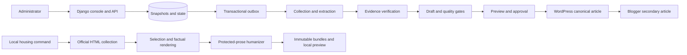

# Wisdome Super Writer service analysis

## Analysis baseline

| Item | Current value |
| --- | --- |
| Updated | 2026-10-03, Asia/Seoul, after the requested two-round review |
| Branch/source | main at 7eb33310665dfffafa15561d66d6d1a2d4b48e6b plus uncommitted repairs |
| Commit | 2026-08-30; fix: bind local web service to port 7667 |
| Initial state | Initial analysis was clean. This review preserved existing README links, AGENTS/CLAUDE bridges and the initial canonical reports. |
| Scope | All major code/service domains, contracts/console, deployment/local tooling, migrations and relevant tests; explicit semantic-read/sampling limits retained |
| Review method | Three critical read-only reviewers, main verification/repair, then three fresh reviewers and second main repair |
| Companion | [Code analysis](code-analysis.md) |
| Current evidence | [Two-round adjudication](analysis/2026-10-03-two-round-review.md) |
| Continuation | [Completed English modification plan](superpowers/plans/2026-10-03-critical-review-remediation.md) |

Main repaired demonstrated defects in collection, evidence, quality, credentials,
media, schedules, reports and local tooling. These conclusions describe current
source plus working-tree changes, not a deployed production instance. Unfinished
withdrawal/visual integration, fresh immutable release approval and actual distributed
acceptance remain open. No dependency/lockfile or task-checkbox changes, commit/push,
or live publisher operations occurred.

Starting references:
[README](../README.md), [task ledger](../specs/001-automated-content-publishing/tasks.md),
[feature specification](../specs/001-automated-content-publishing/spec.md),
[operations handoff](../specs/001-automated-content-publishing/T031_WORK_IN_PROGRESS.md),
and [dated local acceptance](acceptance/2026-08-28-live-housing-acceptance.md).
Their different dates and scopes are kept separate from current verification.

## Purpose and users

Wisdome Super Writer helps an administrator collect South Korean housing notices
and domestic/global semiconductor news, preserve evidence, prepare Korean articles,
review factual/editorial eligibility, and publish to WordPress and Google Blogger.
The distributed design uses WordPress as the canonical original and Blogger as
secondary distribution.

A separate Windows local workflow collects recent ApplyHome/LH residential notices,
renders Markdown and original illustrative graphics, humanizes protected prose
through a sibling service, and previews immutable output. Local mode does not
externally publish. Administrative APIs require an active staff session; local
preview/status routes instead require a loopback client and are development tools.

## Architecture and runtime modes

| Boundary | Local runtime | Distributed runtime |
| --- | --- | --- |
| Supported purpose | Development-only housing writing and preview | Collection, extraction, editorial review, scheduling, publishing |
| Web | Django on `127.0.0.1:7667` | Gunicorn/WSGI in Compose; container port 8000 |
| Database | SQLite under `.local/state/` | PostgreSQL with separate deployment/runtime roles |
| Execution | Synchronous local workflow; Celery eager setting | Celery/Redis and 15 declared queues |
| Storage | `.local/objects/` and `output/housing/` | Private MinIO/S3 plus controlled publication/media delivery |
| Generation | Deterministic housing renderer and loopback humanizer | Evidence-bound deterministic template generator and editorial gates |
| Additional dependencies | Sibling `ai-text-makes-likes-human`, Node/Codex prerequisites | OCR/HWP workers, approved profiles, object storage, publisher credentials |
| External publishing | Runtime policy disables publishing boundaries | Implemented with approvals, current material, validation and operational controls |

`WISDOME_ENVIRONMENT` must explicitly select development or production. Development
defaults to local; production defaults to distributed and rejects local mode.
The Compose shared container environment now explicitly selects distributed mode.
Production configuration validates secrets, hosts, HTTPS origins, database, broker,
and storage settings at startup. These checks are configuration safeguards, not
verification that a production deployment works.

This shows implemented paths, not completed release acceptance.
Evidence: [settings](../src/wisdome_writer/settings/__init__.py),
[runtime validation](../src/wisdome_writer/runtime_mode.py),
[publishing policy](../src/wisdome_writer/external_publishing.py), and
[Compose](../compose.yaml).

## Implemented behavior

### Local housing workflow

`collect_recent_housing` accepts a 1–31 day KST window, selected IDs,
humanization/article-writing controls, approved fixture input, and dry-run mode.
Live collectors use ApplyHome and LH public HTML. Optional official API observations
are reconciled against HTML when `DATA_GO_KR_SERVICE_KEY` is supplied. This analysis
did not use a real service key or perform a new official-source run.

The selection policy indexes known residential categories, excludes recognized
non-residential categories, and writes detailed articles for sale/public-sale/
remaining-supply notices, explicit selections, and qualifying corrections to
previously detailed articles. Rendering explicitly labels missing facts for
original-notice confirmation instead of inferring them.

The workflow keeps factual Markdown and front matter separate from editable prose.
Humanizer verification rebuilds protected input and checks anchors, facts, links,
source/image material, and audit hashes. Failures remain recorded and affect
completeness; fixture or dry-run execution cannot count as successful live acceptance.

The bundle writer uses filesystem locks, confined paths, identity checks, atomic
publication, per-file hashes, unique immutable run directories, and strict run
inventories. Preview routes independently validate bundles, constrain official
links, apply CSP/cache/security headers, and reject path escapes/non-loopback clients.
Local graphics include an illustrative hero, summary card, and timeline.

This local path does not execute the full distributed registry/extraction/approval
workflow. It uses its own official-source, selection, rendering, and bundle policies.
The recorded historical local acceptance deliberately did not download official
attachment bytes; attachment-only facts remain a product limitation.

Evidence: [command](../src/apps/local_content/management/commands/collect_recent_housing.py),
[selection](../src/apps/local_content/selection.py),
[workflow](../src/apps/local_content/workflow.py),
[humanizer](../src/apps/local_content/humanizer.py),
[bundles](../src/apps/local_content/bundles.py), and
[preview](../src/apps/local_content/views.py).

### Distributed collection, extraction, and editorial work

The code contains source registry snapshots/heads/decisions, access and rights
policies, housing and semiconductor adapters, collection attempts and source status
lineage, extraction attempts/profiles, event clustering and verification, article
revisions, and correction orchestration. Seed registries contain three housing and
five semiconductor source entries; configured sources are not proof of live coverage.

Extractor code covers HTML, structured documents, spreadsheets, HWPX, PDF/OCR,
browser/media boundaries, and legacy HWP. PaddleOCR is optional, with model/profile
verification and specialized workers. Source and profile eligibility still depend
on approved material and actual verification results.

Distributed drafting invokes `SourceGroundedTemplateGenerator`, a deterministic
evidence-bound writer. No general in-repository LLM article-generation adapter was
found. Editorial policy declares ten mandatory quality checks and an extra visual
rights/alt-text gate when visuals are used. Claims, citations, exclusions,
verification material, revisions, and policy snapshots form immutable decision inputs.

Evidence: [topic services](../src/apps/topics/services.py),
[collection services](../src/apps/collection/services.py),
[evidence tasks](../src/apps/evidence/tasks.py),
[profiles](../src/apps/evidence/profiles.py),
[generator](../src/adapters/generators/template.py), and
[editorial policy](../src/apps/editorial/policies.py).

### Publishing and operations

Targets/credential references, target snapshots, canary runs, server-derived
auto-publish validations, activations, intents, approval heads, dispatches, fenced
attempts, reconciliation observations, published asset snapshots, and media-delivery
operations are implemented.

Current approval-head/version checks prevent a historical approval from serving as
current permission. Intent and dispatch have separate canonical replay boundaries.
Execution/reconciliation generations bind results to current attempts. Blogger
depends on the exact canonical WordPress attempt in the dispatch cohort. These
mechanisms address duplicate/stale work; real remote exactly-once behavior is not
established by source inspection or mocked tests.

Schedule CRUD/CAS, frozen tick material, due scans, queue-one/coalescing, kill switch,
run stop/selective retry, corrections, retention preview/approval/execution, and
audit querying have code and focused tests. The authoritative ledger still leaves
several tasks unchecked because dependency and external acceptance conditions remain.

Evidence: [publishing services](../src/apps/publishing/services.py),
[models](../src/apps/publishing/models.py),
[automation](../src/apps/publishing/automation.py),
[scheduling](../src/apps/scheduling/services.py), and
[retention](../src/apps/audit/retention.py).

## Behavior corrected by the two reviews

| Service boundary | Current implemented and locally verified behavior | Remaining limit |
| --- | --- | --- |
| Optional official API reconciliation | Filtered count drives pagination; both counts and received records are validated | No new credentialed ODCloud live run |
| Collection | Attachment-free records persist; change events use plain strings; only the current running delivery settles results/failure | Actual broker reclaim and PostgreSQL interleavings unexecuted |
| Extraction | Structural HTML locators resolve actual nodes; XLSX date/time/duration serializes; CSV/TSV locators and cumulative budgets agree with persistence | Supported live/corpus acceptance, OCR calibration still required |
| Raw evidence and rights | Frozen source_record envelope has a resolvable pointer; child rights/manual review retain input restrictions | Local attachment-only facts still not provided |
| Editorial quality | Cited numeric factual quantities require unit-normalized span support; contradictory price controls fail | This is not complete semantic entailment or a general LLM fact checker |
| Approval/validation | Correct proof scope and audit replay; producer/consumer preview hashes with narrow empty-history compatibility; bounded version/digest-verified truthful stage reports | Actual channel canary/pilot and operator approval unexecuted |
| Credential disconnect | Original accepted identity/version remains bound; pending replacement and per-write guards prevent rebinding; exact WordPress self-revocation and Blogger guard tested | No actual remote credential rotation/revocation |
| Publication/media | Accepted future time survives media waits; mapping reuse needs exact timestamped proof; uncertain deletion retains recovery evidence | Final visual embedding, staged Blogger ordering and remote absence proof remain open |
| Due schedules | Ineligible material records an audited hold, advances its captured tick and does not starve healthy schedules | Real scheduler/broker recovery acceptance still required |
| Administrator contracts | Cron/edit-topic/MFA, target capability casing/nullability and evidence source links repaired with schema/actual JS tests | Renderless withdrawal console remains a T026 integration gap; no browser journey here |
| Files and acceptance | Owned cleanup, Unicode/CLI boundaries and current-run/eligible-history verification repaired | Linux converter and actual live acceptance are separate |
| PostgreSQL/release | Forward retention guard migration and qualified nullable-join locks added; new draft profiles/policy versions prepared | Compiler/SQLite checks do not execute PostgreSQL; drafts do not authorize rollout |

See the [main adjudication](analysis/2026-10-03-two-round-review.md) for every A–F
finding, reproduction, rejected hypothesis and regression. The six reviewer reports
retain dated snapshots; main's final dispositions supersede their pre-repair claims.

## Safety and operational boundaries

- Admin API middleware checks active staff/session/CSRF and unsafe-request media
  types. High-impact actions use action/session-bound, expiring reauthentication
  proofs with throttling and replay rules.
- Outbound HTTP validates public destinations, pins DNS, rechecks redirects, bounds
  streaming/deadlines, and redacts sensitive URL material. Local collectors add
  official host/path restrictions.
- Audit, snapshots, and decisions have append-only ORM/database guards. Business
  changes, audit records, and outbox events use transaction boundaries. Dispatch
  and consumer leases provide deduplication, retry and dead-letter recovery.
- Local publishing API/console/event/service boundaries are disabled by policy.
- Legacy HWP has a constrained networkless sandbox/client implementation, but
  `validate_legacy_hwp_activation_config` deliberately returns `False`. Signed
  versioned acceptance-byte/trust-root verification is missing. Old 1.1.0 and new
  1.2.0 candidate profiles remain golden-unapproved. The candidate still needs an
  actual rebuilt/pinned converter manifest; full-root draft import is blocked.
- Distributed readiness checks DB, broker and outbox, but does not establish object
  storage, all workers, OCR readiness, or publisher availability.

These are implementation observations, not production security certification.
See [code findings](code-analysis.md#findings-and-priorities) for precise boundaries.

## Readiness and actual verification

| Area | Implementation | Current conclusion |
| --- | --- | --- |
| Local housing writer | Implemented, immutable output and corrected Windows fixtures | Clean local deterministic verification; historical live acceptance remains historical |
| Official API reconciliation | Filtered-count/strict-envelope repair implemented | Fixture coverage; no new credentialed source run |
| Distributed pipeline | Repaired provenance/rights/numeric grounding and stale settlement | Local domain tests; no real distributed deployment/corpus acceptance |
| Publishing/operations | Extensive state/approval/media code with validated repairs | Withdrawal console and approved visual body still unfinished; remote acceptance open |
| PostgreSQL | Forward retention migration and qualified locks present | Thirteen production expressions compile; actual SQL/trigger/race execution absent |
| Release material | HTML/spreadsheet/HWP 1.2.0 drafts, editorial policies 1.1.0 | Two non-HWP drafts imported in disposable SQLite; fresh source/profile/policy verification and approval needed |
| OCR/HWP | Optional OCR; constrained HWP sandbox/client | OCR corpus/calibration unexecuted; HWP activation hard-false/golden-unapproved |
| Lint | Local-content/new tests/migrations clean | Whole Ruff fails with 1,561 findings |
| Task authority | 17 of 33 IDs checked at existing ledger | Checkboxes unchanged; dependencies/acceptance determine completion |

T001–T014, T023, T029 and T030 are checked. T015–T022, T024–T028 and T031–T033
remain unchecked; checkbox counts are not effort percentages or absence of code.

### Commands executed for the current review

| Check | Actual result |
| --- | --- |
| Locked development environment | Python 3.12.10, Django 5.2.16, uv 0.12.19, Ruff 0.16.0; dependencies unchanged |
| Current AST inventory | 335 Python files parsed; src 251 files/108,908 lines, tests 77/40,644, scripts 7/1,105 |
| Django check / makemigrations --check --dry-run | Exit 0; no issues/no drift |
| Fresh disposable SQLite migrate / migrate --check | All migrations including collection 0012/0013 applied; no pending migrations |
| HTML/spreadsheet draft import | created=2 unchanged=0; full-root import blocked by unresolved HWP converter manifest |
| PostgreSQL production-query compiler tests | 13 qualified-lock expressions pass; connections forbidden |
| Local-content Ruff / new review tests and migrations | Passed |
| Whole Ruff | Exit 1; 1,561 findings, initial analysis 1,561 |
| First integrated repair suite | 1,319 passed, 3 skipped, 7 warnings, 203 subtests; 596.37 s |
| Second check before final fixture/SQL/link repair | 1 failed, 1,348 passed, 3 skipped, 7 warnings, 203 subtests; 613.51 s |
| Corrected dispatch fixture group | 26 passed, 20 subtests; fake publication now provides accepted schedule save |
| Final integrated suite | Exit 0; 1,363 passed, 3 skipped, 7 warnings, 203 subtests; 620.21 s |
| git diff --check | Passed |

After the full suite, formatting-only cleanup removed 25 introduced Ruff findings.
Affected product-file/local-script fixture ASTs remain identical; 39 relevant tests
pass after cleanup, and draft import repeats with created=0 unchanged=2.

Checks use development/local and PYTHONUTF8=1. Pytest removes inherited LOCAL_* root
overrides instead of setting empty values, preserving default/fixture-local roots.
Fresh migration/profile checks use .local/reviews/final-check-state. CI/setup pin
uv 0.12.7; this PC's 0.12.19 execution is not hosted CI equivalence. Warnings concern
absent generated staticfiles; skipped platform paths are not established acceptance.

### Initial and historical evidence

Before authorized fixes, the initial analysis suite had 1,261 passed/26 failed,
3 skipped/198 subtests. A state-root override and missing .env.local contaminated
setup/default-path cases; an intermediate cleanup left empty overrides. A clean
ASCII-path recheck left two fixture failures: copied venv launcher without pyvenv.cfg,
and a fixed 0.4-second lock-start sleep. The independent lock probe first observed
denial at 0.453 seconds, then 32 denied samples with unchanged helper hash.
Separate probes reproduced Korean-path PowerShell UTF-8 script/JSON failures.
These supported explicit fixture/synchronization/encoding repairs, now implemented.
Old failure recommendations are historical, not current release conclusions.

The [2026-08-28 local acceptance record](acceptance/2026-08-28-live-housing-acceptance.md)
reports 72 official observations, 29 exclusions, 43 indexed residential notices,
19 detailed articles and 57 images. Its matrix records 1,276 passed, 5 skipped,
198 subtests and 1,561 Ruff findings; Brave covered details and representative mobile.
No new source/browser run reproduced this evidence; ignored live bundles were absent
at initial checkout. Historical port 8000 references predate local port 7667.

No fresh official source, sibling humanizer, authenticated/visual browser journey,
PostgreSQL execution, Redis/Celery delivery, MinIO/S3 integration, publisher canary/
pilot/publication, actual OCR corpus, Linux HWP/signed artifacts, benchmark,
vulnerability audit or hosted CI was performed. SQLite/compiler/mock/source evidence
cannot prove specification timeliness, accuracy, approval-rate or exactly-once targets.
Raw ignored .local/reviews and .local/analysis output supplement these durable reports.

## Risks and priorities

| Priority | Current risk/implication | Action/evidence |
| --- | --- | --- |
| P0 for supported HWP release | Admission cannot activate without verified signed material | Implement acceptance-byte/trust-root validator and real supported corpus/build evidence; keep golden false |
| P0 for distributed release | PostgreSQL and actual stack/channel acceptance absent | Plan Tasks 1/6: populated migrations, roles, races, broker/storage/publisher/operations journeys |
| P0 for rollout | Current bytes invalidate historical approved material | New source/profile/policy release verification, ordinary approval and revalidated activation; never rewrite old hashes |
| P1 | Withdrawal-only intents abort content-oriented console review | T026 action-specific server subject, scoped proof and browser journey |
| P1 | Approved uploaded images are absent from final body | T022 approved slot/URL/hash/payload integration and actual post verification |
| P1 investigation | Blogger media might run before canonical dependency eligibility | Staged future-media cohort fixture before accepting a defect or weakening guards |
| P1 | Large orchestration and 1,561 Ruff findings | Introduced style diagnostics removed; triage old debt and invariant-preserving decomposition after backend tests |
| P1 | Readiness observes only selected dependencies | Define/exercise storage, workers, OCR and channel readiness/alerts |
| P2 | Preview history cost and local retention ownership unclear | Benchmark without weakening integrity; decide retention/backup/recovery ownership |

Windows fixture and Unicode assumptions identified by initial analysis were repaired
and verified locally. Conditional MOTIR format routing, quality-blocked queue-one/
manual edit and restored-source eligibility traces remain investigations with explicit
regressions in the plan, not confirmed incidents. Historical T031/WIP acceptance
is retained rather than silently rewritten.

## Open product questions

1. Is the next supported deliverable the Windows housing writer or the complete
   distributed housing/semiconductor publishing service?
2. Is deterministic prose sufficient, or is a future evidence-constrained LLM
   generator a separate requirement?
3. Must local articles include attachment-only facts, and which extraction and
   approval path should provide them?
4. Who independently signs OCR/HWP acceptance and approves publishing canary/pilot
   evidence, and which corpora/channels form the minimum supported set?
5. What source-span/semantic assurance is required beyond the implemented numeric
   contradiction checks, and how should correction/withdrawal review appear?
6. What collection cadence, partial-failure behavior, notifications, volume,
   retention, backup/restore, and availability objectives should be supported?

These decisions guide the explicit continuation plan; they do not reopen the two
completed review-and-repair rounds.

## Handoff and update log

[Project AGENTS.md](../AGENTS.md) registers this report and the code report.
Before another analysis, read the existing reports, compare their source baseline
with current HEAD/branch/working-tree changes, verify affected conclusions, refresh
the same files, and record actual new checks. Preserve dated acceptance and task
dependency authority.

| Date | Update |
| --- | --- |
| 2026-10-03, initial | Runtime/architecture/initial checks and historical evidence separated; shared workflow and setup/encoding/lock diagnoses established |
| 2026-10-03, two-round update | Six critical reviewers; main revalidated and repaired code, added regressions/migrations/release drafts, and completed the English continuation plan; original evidence and actual limits preserved |
